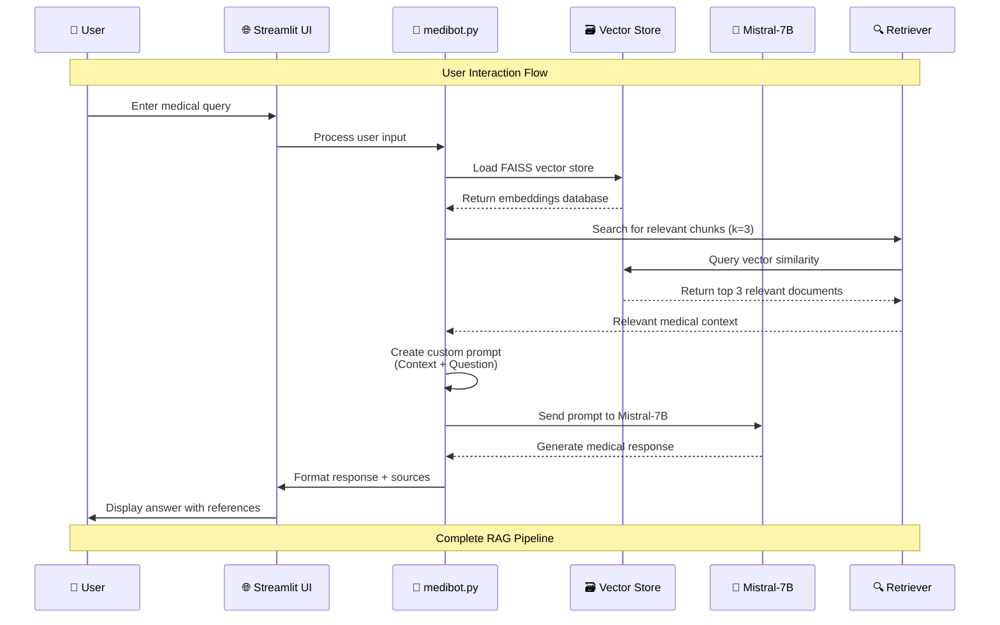
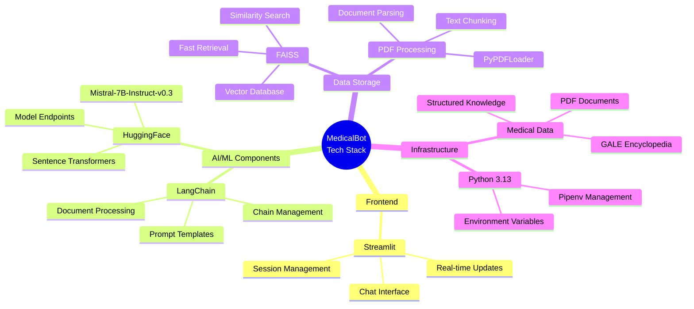

# MedicalBot Workflow Diagram

This diagram illustrates the complete architecture and data flow of the MedicalBot system, from medical document processing to user interaction.

## Quick ASCII Overview

```
Medical PDFs → Document Processing → Vector Database → RAG Pipeline → Web Interface
     │               │                    │               │              │
   data/      create_memory_for_llm.py   FAISS       medibot.py    Streamlit UI
                                                         │
                                              ┌─────────────────────┐
                                              │  User Query Input   │
                                              ▼                     │
                                      Vector Search ────────────────┘
                                              │
                                              ▼
                                      LLM Generation
                                              │
                                              ▼
                                      Medical Response
```

## System Architecture Overview

```mermaid
graph TD
    %% Data Preparation Phase
    A[Medical PDF Documents<br/>📄 data/] --> B[create_memory_for_llm.py<br/>🔧 Document Processing]
    
    B --> B1[PyPDFLoader<br/>📖 Load PDFs]
    B1 --> B2[RecursiveCharacterTextSplitter<br/>✂️ Create Text Chunks<br/>Size: 500, Overlap: 50]
    B2 --> B3[HuggingFaceEmbeddings<br/>🤖 sentence-transformers/all-MiniLM-L6-v2]
    B3 --> B4[FAISS Vector Store<br/>🗃️ vectorstore/db_faiss]
    
    %% LLM Connection Phase
    B4 --> C[connect_memory_with_llm.py<br/>🔗 LLM Integration]
    C --> C1[Load FAISS Database<br/>📚 Vector Retrieval]
    C1 --> C2[HuggingFace Endpoint<br/>🧠 mistralai/Mistral-7B-Instruct-v0.3]
    C2 --> C3[RetrievalQA Chain<br/>⛓️ RAG Pipeline]
    
    %% Main Application Phase
    C --> D[medibot.py<br/>🌐 Streamlit Web App]
    D --> D1[User Interface<br/>💬 Chat Interface]
    D1 --> D2[User Query<br/>❓ Medical Question]
    
    %% Query Processing Flow
    D2 --> E[Query Processing Pipeline<br/>🔄]
    E --> E1[Load Vector Store<br/>📖 get_vectorstore()]
    E1 --> E2[Create QA Chain<br/>⚙️ RetrievalQA.from_chain_type()]
    E2 --> E3[Vector Similarity Search<br/>🔍 k=3 most relevant chunks]
    E3 --> E4[Custom Prompt Template<br/>📝 Context + Question]
    E4 --> E5[LLM Generation<br/>🤖 Mistral-7B Response]
    E5 --> E6[Response + Source Documents<br/>📋 Complete Answer]
    E6 --> D1
    
    %% Styling
    classDef processFile fill:#e1f5fe,stroke:#01579b,stroke-width:2px
    classDef llmComponent fill:#f3e5f5,stroke:#4a148c,stroke-width:2px
    classDef userInterface fill:#e8f5e8,stroke:#1b5e20,stroke-width:2px
    classDef dataStorage fill:#fff3e0,stroke:#e65100,stroke-width:2px
    
    class B,C,E processFile
    class C2,E5 llmComponent
    class D,D1,D2 userInterface
    class B4,E1 dataStorage
```

## Detailed Component Flow



## Technology Stack



## Data Flow Summary

1. **Document Ingestion**: Medical PDFs are loaded and processed into text chunks
2. **Embedding Creation**: Text chunks are converted to vector embeddings using sentence transformers
3. **Vector Storage**: Embeddings are stored in FAISS for efficient similarity search
4. **User Query**: User submits medical question through Streamlit interface
5. **Retrieval**: System finds most relevant document chunks using vector similarity
6. **Context Formation**: Retrieved chunks are formatted into context for the LLM
7. **Response Generation**: Mistral-7B generates medical response based on context
8. **Answer Delivery**: Response is displayed to user with source document references

## Key Features

- **RAG Architecture**: Retrieval-Augmented Generation for factually grounded responses
- **Medical Knowledge Base**: Trained on comprehensive medical encyclopedia
- **Real-time Chat**: Interactive web interface with conversation history
- **Source Attribution**: Responses include references to source documents
- **Scalable Vector Search**: FAISS enables fast similarity matching
- **Customizable Prompts**: Tailored prompts for medical query handling

## File Responsibilities

| File | Purpose | Key Components |
|------|---------|----------------|
| `create_memory_for_llm.py` | Document processing and embedding creation | PyPDFLoader, TextSplitter, FAISS |
| `connect_memory_with_llm.py` | LLM integration and testing | HuggingFace Endpoint, RetrievalQA |
| `medibot.py` | Main application and user interface | Streamlit, Chat Interface, Session Management |